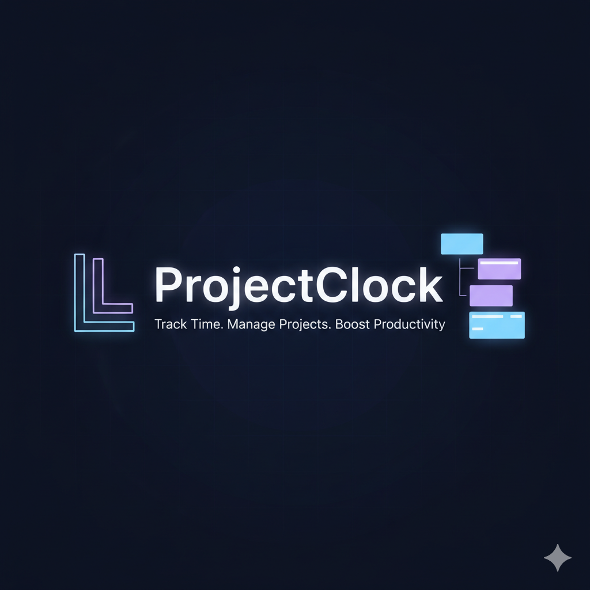

# ProjectClock 🕒

**Professional project time tracking with smart notes and session management**

A beautiful, feature-rich desktop application built with Electron for tracking time across multiple projects with integrated note-taking and session management.



## ✨ Features

### 🎯 **Project Management**

- Create unlimited projects with names and detailed aims
- Visual project cards showing time tracked, sessions, and notes
- Project-specific time tracking and note organization
- Easy project switching with context preservation

### ⏱️ **Advanced Timer**

- Clean, intuitive timer interface with progress ring
- Start/pause/reset functionality with keyboard shortcuts
- Automatic session counting and total time tracking
- Visual progress indicators and status updates

### 📝 **Smart Notes System**

- Time-stamped notes with categories (Task, Meeting, Break, etc.)
- Status tracking (New, In Progress, Completed)
- Real-time search and filtering
- Quick action templates for common note types
- Export functionality for backup and sharing

### 🎨 **Beautiful Interface**

- Modern dark theme with smooth animations
- Responsive design that adapts to different screen sizes
- Intuitive navigation with breadcrumbs
- Professional gradient designs and visual feedback

### 💾 **Data Management**

- Local storage for privacy and offline functionality
- Automatic data persistence and recovery
- Project deletion with safety confirmations
- Bulk operations for managing multiple projects
- Data export in JSON format

## 🚀 Getting Started

### Prerequisites

- Node.js (v14 or higher)
- npm or yarn package manager

### Installation

1. **Clone the repository**

   ```bash
   git clone https://github.com/yourusername/projectclock.git
   cd projectclock
   ```

2. **Install dependencies**

   ```bash
   npm install
   ```

3. **Start the application**
   ```bash
   npm start
   ```

### Building for Distribution

**Windows:**

```bash
npm run build:win
```

**Development Build:**

```bash
npm run build:dir
```

## 🎮 Usage

### Creating Your First Project

1. Launch ProjectClock
2. Click "New Project" on the main screen
3. Enter a project name and detailed aim/description
4. Click "Create Project"

### Time Tracking

1. Select a project from the list
2. Click the "View Aim" button to review your project goals
3. Use the timer controls:
   - **Start/Pause**: Space bar or click the play button
   - **Reset**: R key or click the reset button
   - **Add Note**: N key or click the note button

### Managing Notes

- Add time-stamped notes during work sessions
- Categorize notes (General, Task, Milestone, Break, Meeting)
- Set status (New, In Progress, Completed)
- Search and filter notes in real-time
- Export notes for external use

### Keyboard Shortcuts

- `Ctrl/Cmd + Space`: Start/Pause timer
- `Ctrl/Cmd + R`: Reset timer
- `Ctrl/Cmd + N`: Add new note
- `Ctrl/Cmd + P`: New project or return to projects
- `Ctrl/Cmd + E`: Export notes
- `Escape`: Close modals and forms

## 🏗️ Project Structure

```
projectclock/
├── src/                    # Source code
│   ├── main.js            # Electron main process
│   ├── renderer.js        # Main application logic
│   ├── preload.js         # Preload scripts
│   ├── index.html         # Application HTML
│   └── styles.css         # Application styles
├── assets/                # Static assets (icons, images)
├── docs/                  # Documentation and screenshots
├── dist/                  # Built application (generated)
├── package.json           # Project configuration
├── README.md             # This file
└── .gitignore           # Git ignore rules
```

## 🛠️ Development

### Tech Stack

- **Electron**: Cross-platform desktop app framework
- **HTML/CSS/JavaScript**: Core web technologies
- **Local Storage**: Data persistence
- **Modern CSS**: Grid, Flexbox, CSS Variables, Animations

### Code Style

- Modern ES6+ JavaScript
- Semantic HTML structure
- CSS custom properties for theming
- Mobile-first responsive design
- Accessibility considerations

### Contributing

1. Fork the repository
2. Create a feature branch (`git checkout -b feature/amazing-feature`)
3. Commit your changes (`git commit -m 'Add amazing feature'`)
4. Push to the branch (`git push origin feature/amazing-feature`)
5. Open a Pull Request

## 📸 Screenshots

### Project List


### Timer Interface


### Notes Management


## 🔧 Configuration

ProjectClock stores data locally using browser localStorage. Data includes:

- Project information (name, aim, creation date)
- Time tracking data (sessions, total time)
- Notes with timestamps and metadata

## 🐛 Known Issues

- None currently reported

## 📄 License

This project is licensed under the MIT License - see the [LICENSE](LICENSE) file for details.

## 👨‍💻 Author

**Hazrat Ali**

- Website: [hazratali.me](https://hazratali.me)
- GitHub: [@hazratali](https://github.com/hazratali)

## 🙏 Acknowledgments

- Electron team for the amazing framework
- Contributors and beta testers
- Open source community for inspiration

## 📊 Roadmap

- [ ] Cloud synchronization
- [ ] Team collaboration features
- [ ] Advanced reporting and analytics
- [ ] Mobile companion app
- [ ] Integration with popular project management tools
- [ ] Custom themes and personalization
- [ ] Time tracking goals and targets

---

**⭐ Star this repository if you find ProjectClock helpful!**
